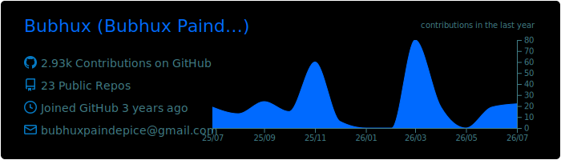
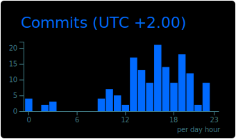

## Hello ! I'm developer back-end junior

#### Check out my portfolio !

- **Portfolio** ➔ 💼 [Discover my portfolio, click here !](https://2eeb9101.portfolio-8ym.pages.dev/)

#### Languages   

  

#### Tools   

  

|  |  |
| :-: | :-: |

|  |  |
| :-: | :-: |

|  |  |
| :-: | :-: |

|  |  |
| :-: | :-: |

|  |
| :-: |

<!--
**Bubhux/Bubhux** is a ✨ _special_ ✨ repository because its `README.md` (this file) appears on your GitHub profile.

Here are some ideas to get you started:

- 🔭 I’m currently working on ...
- 🌱 I’m currently learning ...
- 👯 I’m looking to collaborate on ...
- 🤔 I’m looking for help with ...
- 💬 Ask me about ...
- 📫 How to reach me: ...
- 😄 Pronouns: ...
- ⚡ Fun fact: ...
-->
