## Hello ! I'm Python developer junior

#### Languages   

  

#### Tools   

  

|  |  |
| :-: | :-: |

|  |  |
| :-: | :-: |

|   |  |
| :-: | :-: |

|  |  |
| :-: | :-: |

<!--
**Bubhux/Bubhux** is a ✨ _special_ ✨ repository because its `README.md` (this file) appears on your GitHub profile.

Here are some ideas to get you started:

- 🔭 I’m currently working on ...
- 🌱 I’m currently learning ...
- 👯 I’m looking to collaborate on ...
- 🤔 I’m looking for help with ...
- 💬 Ask me about ...
- 📫 How to reach me: ...
- 😄 Pronouns: ...
- ⚡ Fun fact: ...
-->
